# The Winery
  [The Winery](https://the-winery.herokuapp.com/) is an e-commerce B2C webshop aimed at lovers of fine alcoholic beverages made with grapes.  
  The concept is made around the idea of a small team of people (who love fine wines, champagnes etc.) who enjoy traveling in order to visit wine-farmers directly at their respective farms.  
  They bring home the drinks they enjoy and add them to their shop to share with others who can buy and have them delivered.  
  Their 'adventures' are chronicled in 'The Winery Gazette', a kind of blog page where they keep people updated about which wine-farmers they visited or what might be fun to visit for other wine enthusiasts out there.  

  The website is aimed at wine enthusiasts of all ages but the addition of the blog (which provides a unique interaction with customers) is aimed at attracting younger users.  
  The goal is not only to sell, but to enthuse people to learn more about and enjoy fine wine.  

## Marketing and target audience  
* The site is B2C, aimed at wine enthusiast of all ages but hopeful to attract a younger audience in their 20's and 30's as well.  
* The chosen promotional platform is therefore social media, specifically Facebook.  
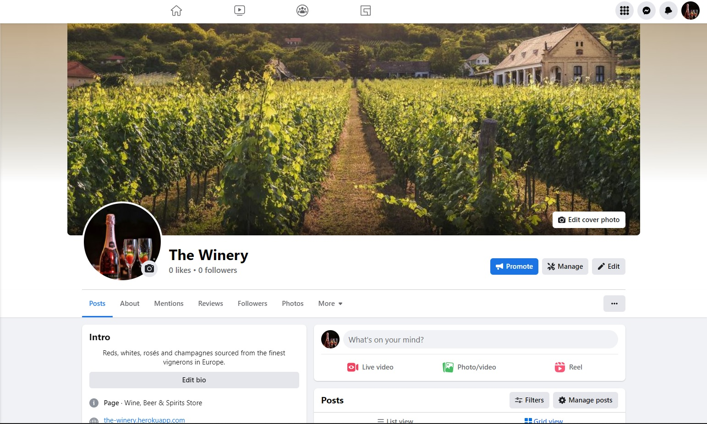  
* A good way to keep potential users interested could be through e-mail subscription with the latest news and offers.  
* Keyword research was done in order to improve the website's SEO:  
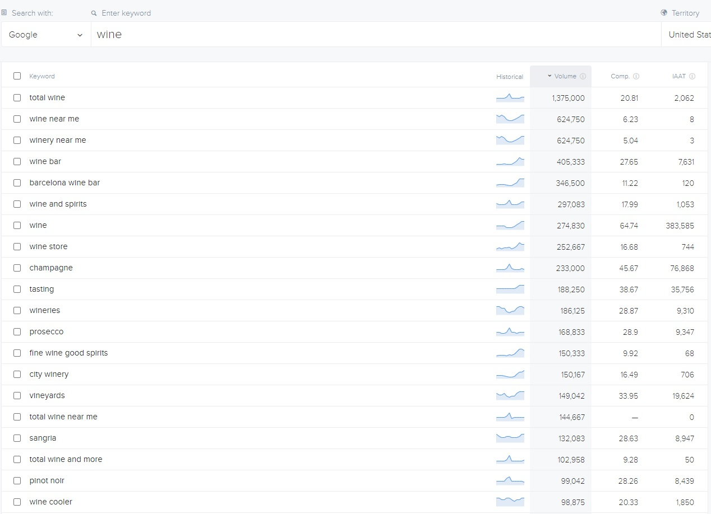  

  
## UX Design  
### User stories
##### Home
* As a site user I want to understand the site's purpose at a glance, so there's no uncertainty that this is what I'm searching for.
* As a site user I want the site's navigation to be easy and instinctual, so that I can find my way around easily.
* As a site user I would like to read about what the shop stands for / what they are about so that I am aware who I am buying products from.
* As a site user I would like to be able to access a FAQ page to see if any questions I have, have perhaps already been addressed.
* As a site user I would like to be able to contact the webshop owner(s) in case of any questions.
* As a site owner I would like to be able to moderate the FAQ page in order to keep it up to date.
##### Account
* As a site user I want to be able to create an account.
* As a site user I want to be able to see my order/payment history.
* As a site user I want to be able to review products in order to help others make informed decisions.
##### Products
* As a site user I want to be able to click on individual products for more details.
* As a site user I want to be able to select/order products based on type or cost etc. so that it's easier to find what I'm looking for.
* As a site owner I want to be able to add products.
* As a site owner I want to be able to edit products.
* As a site owner I want to be able to delete products.
##### Basket
* As a site user I want to be able to add items to my shopping bag, so that I can continue shopping while keeping track of what I wish to buy.
* As a site user I want to be able to delete items from my shopping bag.
* As a site user I want to be able to edit quantities in my shopping bag.
* As a user I want to see a confirmation when I've added or deleted something from my bag, so that I am certain it worked as expected.
##### Checkout
* As a site user I want to be able to see an overview of my order before checkout.
* As a site user I want to see the total amount before proceeding to checkout, so that I am certain what I will have to pay.
* As a site user I want to be able to pay securely.
* As a site user I want to receive an order confirmation after checkout.
##### Mini Blog
* As a site owner I want to be able to write semi-regular blog posts in order to keep customers up to date on the shop's recent exploits and keep them interested in our products.
* As a site user I want to be able to comment on blog posts.
* As a site owner I would like to be able to moderate the comments posted on the mini blog in order to prevent potential offense language or abuse.

### Site goals
* The site is first and foremost a webshop which aims to sell products to its users.
* As a secondary goal the site hopes to entertain and enthuse people for the world of wine beyond their local supermarket.  

### Wireframes  
* Some of my original wireframes, though I eventually changed the landing page to a moving carrousel to draw more attention to the separate features of the site, such as the Winery Gazette etc.  
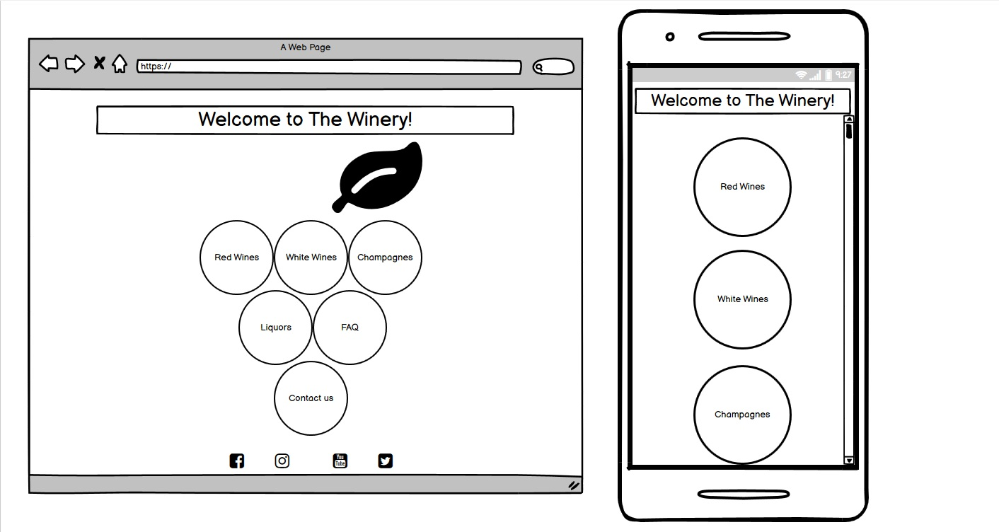  

* The shop has remained mostly the same as I preferred a simple, clean layout, such as was used in the Boutique Ado project.  
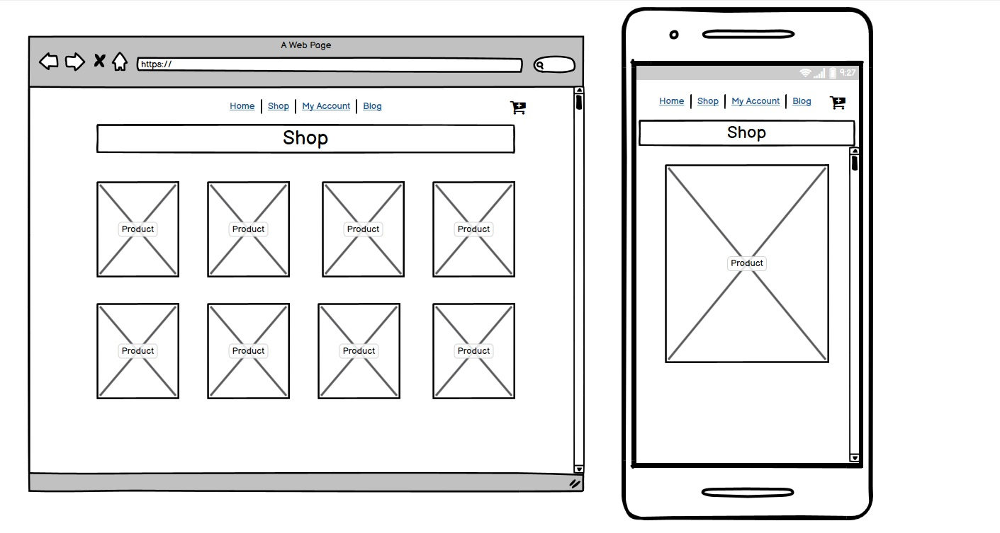  

## Features  
### Existing features
*  The landing page:  
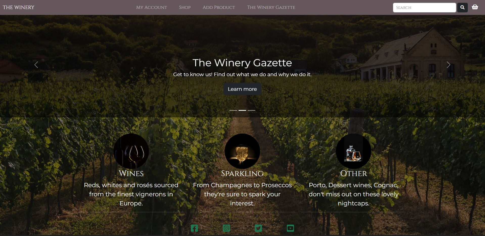  

* For those who seek to buy we have the shopping page:   
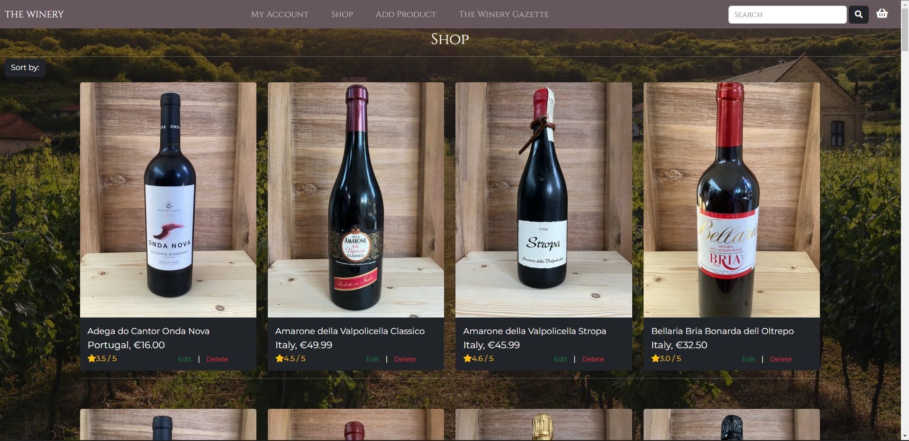  

* The site visitor can look at each individual product in detail:  
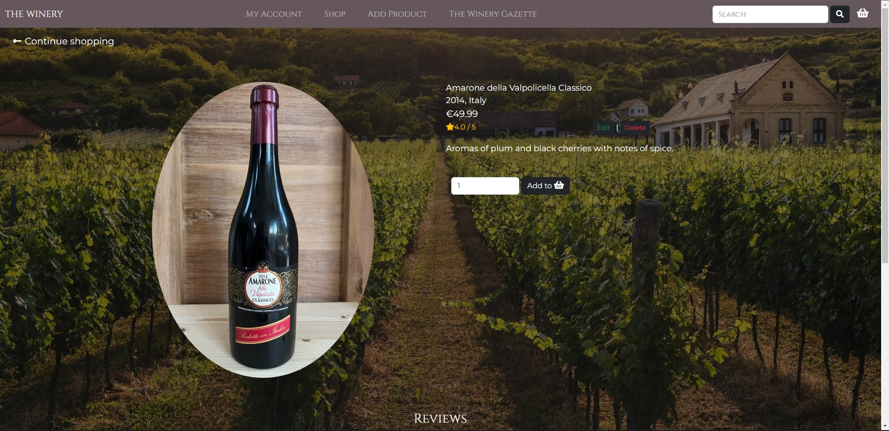  

* When a specific bottle catches their eye site visitors can add it to their shopping basket:  
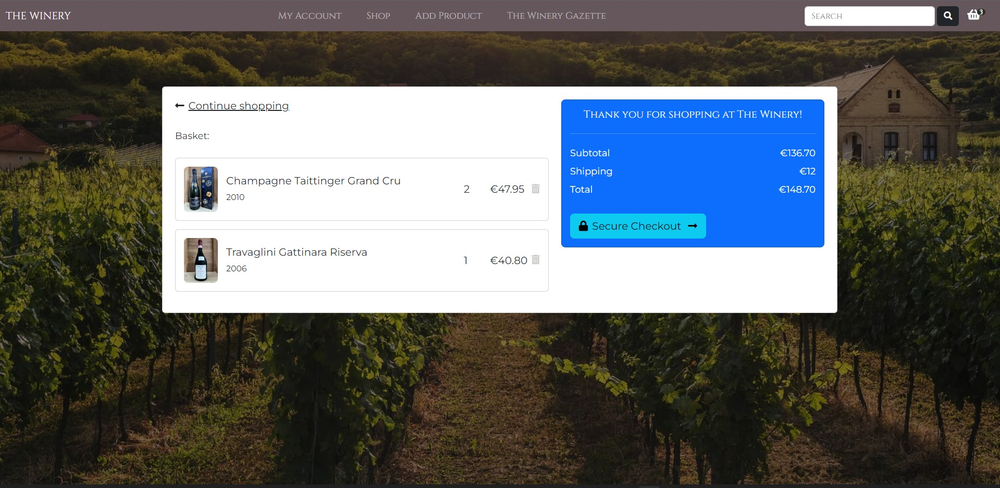  

* And finally we have The Winery Gazette for overall entertainment:  
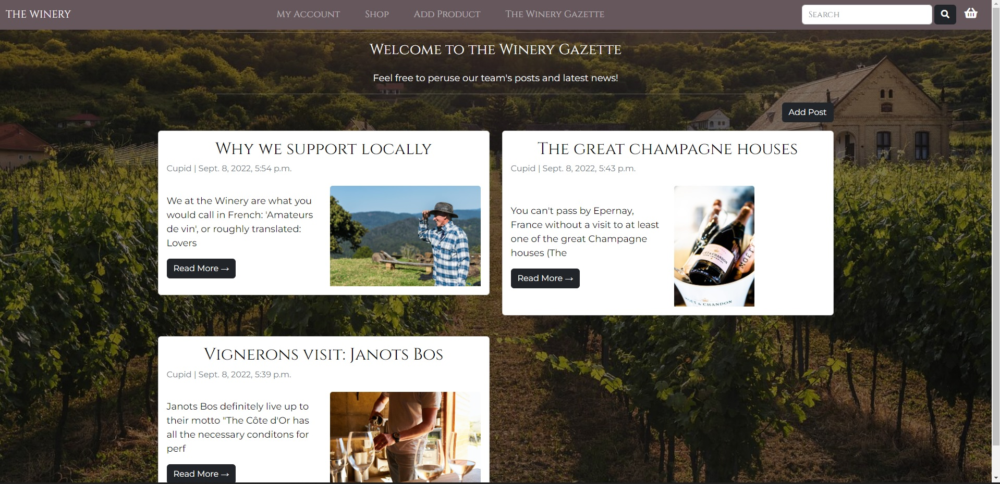  

### Potential future features  
##### As, due to time constrictions, not all elements of the website are functional yet, there are quite a few things that can still be implemented:
* Though site users (who are logged in) can actively review and rate products. Their average ratings only show on the product detail page at this time.  
  The rating visible in the main shop is still a mock-up.  
* Reviews and blog comments can only be approved via the admin panel, not yet directly via the site.   
* Perhaps video footage could be added to the blog for more interactivity.  
* Overall UX and user friendliness could be improved with for example success and error messages.  

## Technologies used  
* Python3
* HTML
* CSS
* [Django](https://www.djangoproject.com/)
* [Bootstrap](https://getbootstrap.com/)
* [GitHub](https://www.github.com)
* [Gitpod](https://www.gitpod.io)
* [Heroku](https://www.heroku.com)  

## Testing  
I have manually tested this project by doing the following:  
* Passed the code through a [Pep8](http://pep8online.com/) linter and confirmed there are no problems.
* Roam around the site both logged in and logged out to test all current functionality.
* Pass the lighthouse test in developer tools for the biggest pages:  
The landing page:  
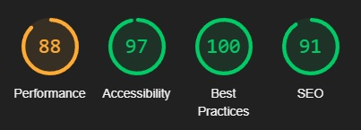  
The shop:  
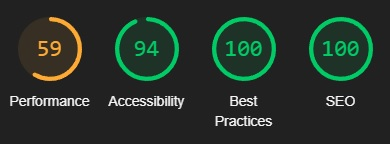  
The Winery Gazette:  
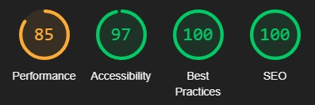  

### User testing:
##### Home
* As a site user I want to understand the site's purpose at a glance, so there's no uncertainty that this is what I'm searching for:  
The landing page immediately showcases 'wines', 'sparkling' and 'other' at the bottom of the page, the header contains the word 'shop' and has a shopping basket icon.  
Finally the background is a vineyard. 
* As a site user I want the site's navigation to be easy and instinctual, so that I can find my way around easily:  
By giving clear names to everything and making many items clickable, I believe this has been achieved. Though there is always room for improvement.  
* As a site user I would like to read about what the shop stands for / what they are about so that I am aware who I am buying products from:  
Though there is no 'about' section, this information can be found in 'The Winery Gazette', which is also indicated in the carousel on the landing page.  
* As a site user I would like to be able to access a FAQ page to see if any questions I have, have perhaps already been addressed:  
This is to be a future addition, I was not able to implement this within the time limit.  
* As a site user I would like to be able to contact the webshop owner(s) in case of any questions:  
Site users (with an account) can interact with the webshop's team on 'The Winery Gazette' through the comments section. However, a direct contact option should be added in the future.  
* As a site owner I would like to be able to moderate the FAQ page in order to keep it up to date:  
This is a future addition, as the FAQ page does not exist yet.  

##### Account
* As a site user I want to be able to create an account:  
Accounts can be created.  
* As a site user I want to be able to see my order/payment history:  
Order history can be seen under the "my account" area.  
* As a site user I want to be able to review products in order to help others make informed decisions:  
Site users (who are logged in) can leave reviews and ratings on individual products.  

##### Products
* As a site user I want to be able to click on individual products for more details:  
Products can be viewed in more detail on the products detail page.  
* As a site user I want to be able to select/order products based on type or cost etc. so that it's easier to find what I'm looking for:  
The site can be ordered based on price and rating. There is still a small bug present here however, which will be expanded upon in the bugs section.  
* As a site owner I want to be able to add products:  
Products can be added by the super user via the website (and of course the admin panel, but that's less desirable).  
* As a site owner I want to be able to edit products:  
Products can be edited by the super user via the website.  
* As a site owner I want to be able to delete products:  
Products can be deleted by the super user via the website.  

##### Basket
* As a site user I want to be able to add items to my shopping bag, so that I can continue shopping while keeping track of what I wish to buy:  
Items can be added to the shopping bag and, though there is no major notification, users can see an icon appear over the basket indicating how many items they currently have inside the basket.  
* As a site user I want to be able to delete items from my shopping bag:  
Items can be deleted from the shopping bag.  
* As a site user I want to be able to edit quantities in my shopping bag:  
Editing quantities inside the basket is not yet possible. This is a future addition.  
* As a user I want to see a confirmation when I've added or deleted something from my bag, so that I am certain it worked as expected:  
Confirmations are a future addition. The icon over the basket does change when an item is added or deleted however.  

##### Checkout
* As a site user I want to be able to see an overview of my order before checkout:  
An order summary is visible on the left of the checkout area.  
* As a site user I want to see the total amount before proceeding to checkout, so that I am certain what I will have to pay:  
The total amount to be paid is calculated and displayed on the right of the checkout area.  
* As a site user I want to be able to pay securely:  
Using stripe's 4242 card you can see that payment now passes through succesfully.  
* As a site user I want to receive an order confirmation after checkout.  
Though users receive a success message on the website, email confirmation is not yet functional. This is a future addition.    

##### Mini Blog
* As a site owner I want to be able to write semi-regular blog posts in order to keep customers up to date on the shop's recent exploits and keep them interested in our products:  
The Winery Gazette is created and several posts are displayed as an example. New posts can be added and existing posts can be edited/deleted by the superuser.  
* As a site user I want to be able to comment on blog posts:  
Logged in users can comment on the blog posts.  
* As a site owner I would like to be able to moderate the comments posted on the mini blog in order to prevent potentially offensive language or abuse:  
Comments have to be approved before they are displayed. This still has to be done from inside the admin panel however, direct moderation from the website will be a future addition.  

### Bugs 
Some of the more prominent bugs were: 
* Solved bugs  
  * Image overlay on an svg circle:  
  The circles on the bootstrap template remained grey no matter what I tried. This was fixed with the help of [Stackoverflow](https://stackoverflow.com/questions/30897108/how-can-i-display-an-image-inside-svg-circle-in-html5)  
  * Basket moved below the toggled navbar in mobile view:  
  This was fixed with the help of [Stackoverflow](https://stackoverflow.com/questions/53695359/collapsing-navbar-moves-uncollapsable-items-away-from-navbar)  
  * Deleting items from shopping cart was done using pop, which caused the interesting effect of adding back in the previously deleted product when more than one item was deleted in a row.  
  This was fixed by saving the session again after popping, so it wouldn't reset back to the previous one.  
  * Though the front-end indicated shipping to be €12,- and this is also the amount which was charged, the back-end calculated €200,- for the shipping costs. I had accidentally set the backend to use the "free_delivery_from" amount (which is €200,-) as the shipping cost rather than "standard_delivery". This has now been corrected.  
  
* Unsolved bugs  
  * Sorting works as expected in the shop directly. However when going to the shop through one of the bottom landing page links (wines, sparkling or other), the sort button will cause all products to appear on the page again, rather than only sorting the selection.  
  This still has to be fixed in future.  
  * Rating on the products page is still a mock-up, rather than the actual customer rating which is visible on the product detail page.      

## Deployment
This project was deployed using Code Institute's mock terminal for Heroku.  
* Steps for deployment:
   * Sign into Heroku
   * Choose New.
   * Choose Create new app.
   * Type in a name for your new app.
   * Select your region from the dropdown menu.
   * Choose Create App.
   * In the settings tab choose config vars.
   * Add the key: PORT with value: 8000.
   * Link up Heroku Postgres.
   * In the deploy tab, select GitHub as the deployment method and connect your GitHub profile.
   * Search for the repository that you wish to deploy to Heroku and click "connect".
   * Choose to automatically deploy and update your app.
   * Click on Deploy

The deployed version can be found here: [The Winery](https://the-winery.herokuapp.com/)

## Credits
[Code Institute](https://www.codeinstitute.net)  
[Code Institute's Boutique Ado Project](https://github.com/Seamse/boutique-ado)  

My mentor [5pence](https://github.com/5pence)  
CI channel lead [Daniel Callaghan](https://github.com/xiaoniuniu89)  
[Bootstrap Template for the landing page](https://getbootstrap.com/docs/5.2/examples/carousel/#)  
[Bootstrap Template for the shopping cart](https://mdbootstrap.com/docs/standard/extended/shopping-carts/)

Images not made by me were taken from:  
[Pexels](https//:www.pexels.com)  

Useful pages were:  
[Slack](https//:www.slack.com)  
[Stack Overflow](https://stackoverflow.com/)  

Specifically used pages:  
[CSS tricks shapes and images](https://css-tricks.com/the-many-ways-to-link-up-shapes-and-images-with-html-and-css/#:~:text=The%20simplest%20way%20to%20make,SVG%20elements%20or%20just%20one.)  
[CSS tricks text on background visibilty](https://css-tricks.com/design-considerations-text-images/)  
[Stack Overflow basket icon counter](https://stackoverflow.com/questions/51304169/how-to-put-the-number-at-top-right-corner-of-cart-icon)  
[Stack Overflow Max date on vintage option](https://stackoverflow.com/questions/49051017/year-field-in-django)  
[Hubspot dropdown button](https://blog.hubspot.com/website/html-dropdown)  
[Djangocentral blog](https://djangocentral.com/building-a-blog-application-with-django/)  
[Djangocentral blog comments](https://djangocentral.com/creating-comments-system-with-django/)  
[Github product reviewing](https://github.com/ksudarshan26/Product-Review-and-Rating-using-Django-Frameworks)  
